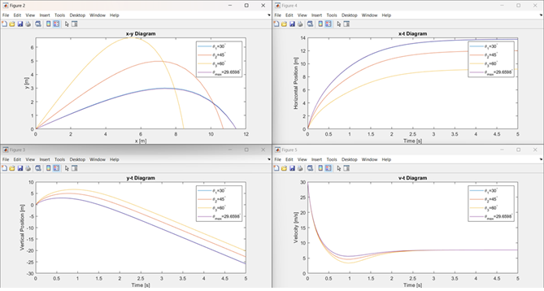
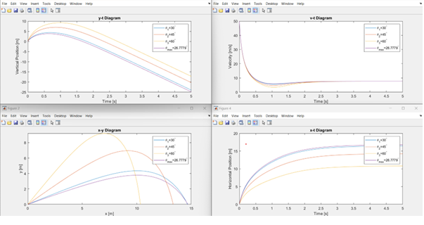
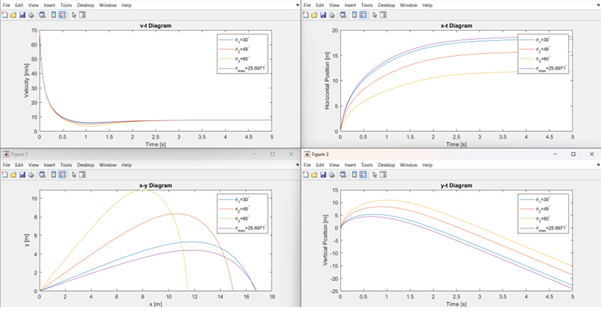

# Projectile Motion Simulation with Air Resistance  

## 📌 Project Overview  
This project analyzes and simulates the motion of a projectile under the influence of gravity, with and without air resistance.  
The study combines analytical equations of motion with numerical simulations in MATLAB to calculate trajectories, velocities, and optimal launch angles.  

The project covers:  
1. Fundamentals of projectile motion (Galileo’s contributions, historical context).  
2. Applications in sports, ballistics, and aerospace.  
3. Analytical derivation of projectile equations (without resistance).  
4. Numerical solution of projectile equations (with air resistance) using ODE solvers.  
5. MATLAB implementation to compute distance, trajectory, and velocity for different launch angles and velocities.  
6. Visualization of results with multiple plots.  

---

## 🎯 Objectives  
- Study projectile motion in both ideal conditions (no drag) and realistic conditions (with drag).  
- Derive and understand equations of motion using kinematic relations.  
- Implement MATLAB code to simulate projectile trajectories.  
- Calculate projectile distance as a function of launch angle.  
- Determine the optimal angle for maximum range.  
- Compare projectile motion for different initial velocities (30, 50, 70 m/s).  

---

## 🛠 Tools & Software  
- MATLAB – Numerical simulations, ODE solver (ode45), and plotting.  
- Analytical Kinematics – Classical motion equations.  
- Mathematical Modeling – Differential equations with drag force.  

---

## 📐 Methodology  

### 1. Analytical Formulation (Without Air Resistance)  
- Projectile launched with initial velocity V0 at angle θ:
Vx0 = V0 cos(θ)
Vy0 = V0 sin(θ)

- Position equations:
x(t) = x0 + Vx0 * t
y(t) = y0 + Vy0 * t - (1/2) g t^2

- Velocity equations:
Vx(t) = Vx0
Vy(t) = Vy0 - g t

### 2. Numerical Simulation (With Air Resistance)  
- Air drag modeled as proportional to velocity: F_drag = -B v.  
- Governing equations solved with MATLAB ODE solver (ode45).  
- MATLAB functions implemented:  
- dSdt: defines state-space equations (position, velocity).  
- get_distance: computes projectile range for different launch angles.  

### 3. MATLAB Implementation  
- Cleared workspace (clc, clear vars, close all).  
- Defined parameters: mass, drag coefficient, gravity, initial velocity.  
- Simulated trajectories at angles 30°, 45°, 60°.  
- Computed projectile range across angles 0°–90° to find the optimal launch angle.  
- Generated comparative plots for x-y, x-t, y-t, v-t diagrams.  

---

## 📊 Results  

- Projectile Range vs. Angle:  
- The optimal launch angle was determined numerically (slightly less than 45° with drag).  
- Trajectory Plots:  
- Showed how air resistance shortens flight distance compared to the ideal case.  
- Velocity-Time Plots:  
- Demonstrated decreasing velocity due to gravity and drag.  
- Comparison of Launch Speeds (30, 50, 70 m/s):  
- Higher velocities increased range and flight duration, but drag had a stronger effect at higher speeds.  

### Simulation Outputs  
-   
-   
-   

---

## 📂 Repository Structure

├── MATLAB/ # MATLAB functions and scripts (dSdt.m, get_distance.m, main.m)

├── images/ # Simulation plots (x-y, y-t, x-t, v-t, range vs. angle)

└── README.md # This file

---

## 🔬 Applications  
- Sports Science: Optimizing throws, kicks, and jumps.  
- Aerospace: Trajectory prediction for rockets, missiles, and projectiles.  
- Ballistics: Firearm and artillery motion studies.  
- Education: Teaching classical mechanics and numerical simulation.  

---

## 👨‍🎓 Author  
- Mohammad Mahdi Khademi
- Negar Naghavian

Supervised by: Dr. Majid Rajabi

Course: Dynamics / Mechanics Project  

---

## 📖 References  
- Classical Mechanics Textbooks.  
- MATLAB Documentation (ODE solvers, plotting).  
- Course lecture notes on projectile motion and drag effects.
